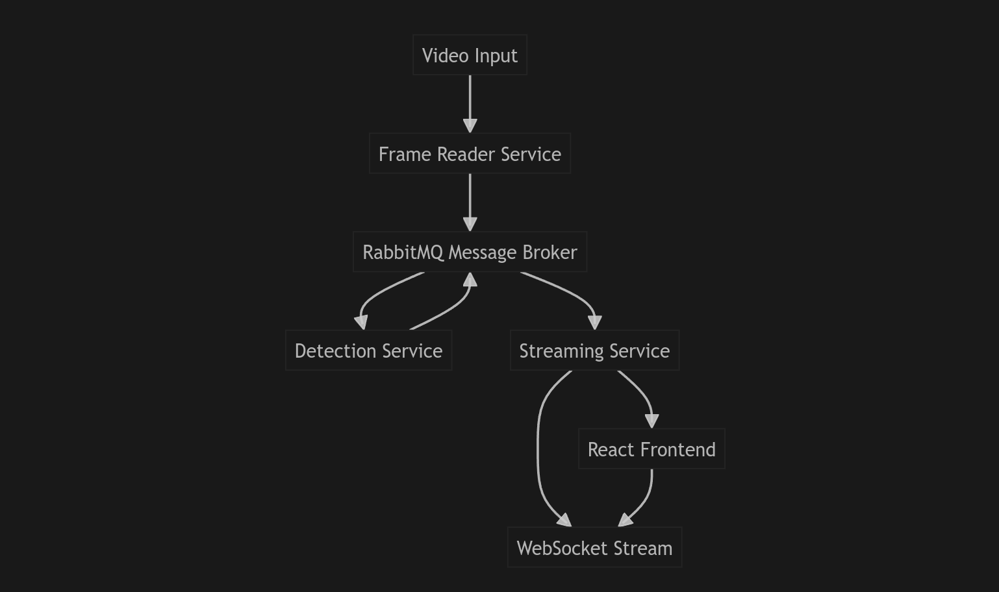

# Pizza Store Hygiene Monitoring System

A real-time microservices-based computer vision system that monitors pizza store workers for hygiene compliance violations. The system detects when workers use their hands instead of scoopers to pick up ingredients from designated Regions of Interest (ROIs) using advanced YOLO object detection and state-based violation logic.

## Demo


## 🎯 Project Overview

This system addresses critical food safety compliance requirements by automatically monitoring worker behavior in real-time. It processes video feeds to detect hand and scooper interactions within configurable ROI regions, flagging hygiene violations when workers use their hands instead of proper utensils.

### Key Objectives
- **Real-time Video Analysis**: Process live video feeds with minimal latency
- **Intelligent Violation Detection**: Distinguish between legitimate and violation behaviors
- **Multi-ROI Support**: Handle different store layouts and ingredient stations
- **Scalable Architecture**: Microservices design for production deployment

## 🏗️ System Architecture





### Microservices Components

1. **Frame Reader Service** (`frame_reader/`)
   - Video ingestion and frame extraction
   - Base64 encoding for message transmission
   - Configurable frame rate optimization

2. **Detection Service** (`detection/`)
   - YOLO model inference for object detection
   - Multi-object tracking with persistence
   - State-based violation detection logic
   - ROI-based filtering and analysis

3. **Streaming Service** (`streaming/`)
   - REST API for video upload and processing
   - WebSocket streaming for real-time updates
   - Processed video generation and download
   - Statistics and violation reporting

4. **Frontend UI** (`frontend/`)
   - React-based monitoring dashboard
   - Real-time video visualization
   - Violation alerts and analytics
   - ROI configuration interface

5. **Shared Components** (`shared/`)
   - RabbitMQ client for inter-service communication
   - Common utilities and configurations

## 🚀 Features

### Core Functionality
- **Real-time Object Detection**: Hand and scooper detection using custom YOLO models
- **Multi-Object Tracking**: Persistent tracking across frames with distance-based association
- **State-Based Violation Logic**: Sophisticated state machine for accurate violation detection
- **ROI Management**: Configurable regions for different store layouts
- **Stabilization Periods**: stabilization periods to reduce false positives


### Technical Features
- **Horizontal Scaling**: Microservices architecture with message queuing
- **Fault Tolerance**: Resilient message processing with error handling
- **Configurable Detection**: Adjustable confidence thresholds and parameters
- **Live Analytics**: Real-time violation counting and statistics
- **Responsive UI**: Modern React interface with real-time updates

## 🛠️ Technology Stack

### Backend
- **Python 3.8+**: Core application language
- **FastAPI**: High-performance web framework
- **OpenCV**: Computer vision and video processing
- **YOLO (Ultralytics)**: Object detection and tracking
- **RabbitMQ**: Message broker for inter-service communication
- **NumPy**: Numerical computing and array operations

### Frontend
- **React 18**: Modern UI framework
- **WebSocket**: Real-time communication
- **Tailwind CSS**: Utility-first styling
- **Lucide React**: Icon components

### Infrastructure
- **RabbitMQ**: Message queuing system
- **Base64**: Image encoding for message transmission

## 📦 Installation

### Prerequisites
- Python 3.8 or higher
- Node.js 16 or higher
- RabbitMQ server
- Git

### Backend Setup

1. **Clone the repository**
   ```bash
   git clone https://github.com/yourusername/pizza_violation_microservices.git
   cd pizza_violation_microservices
   ```

2. **Install Python dependencies**
   ```bash
   pip install -r requirements.txt
   ```

3. **Set up RabbitMQ**
   ```bash
   # Install RabbitMQ (Ubuntu/Debian)
   sudo apt-get install rabbitmq-server
   
   # Start RabbitMQ
   sudo systemctl start rabbitmq-server
   sudo systemctl enable rabbitmq-server
   ```

4. **Configure environment variables (Setting your config)**
   ```bash
   # Copy and edit configuration files
   cp detection/config.py.example detection/config.py
   cp streaming/config.py.example streaming/config.py
   cp frame_reader/config.py.example frame_reader/config.py
   ```

### Frontend Setup

1. **Navigate to frontend directory**
   ```bash
   cd frontend
   ```

2. **Install dependencies**
   ```bash
   npm install
   ```

3. **Start development server**
   ```bash
   npm start
   ```

## 🚀 Quick Start

### 1. Start the Services

**Terminal 1 - Detection Service**
```bash
cd detection
python detection_service.py
```

**Terminal 2 - Streaming Service**
```bash
cd streaming
python streaming_service.py
```

**Terminal 3 - Frontend**
```bash
cd frontend
npm start
```

### 2. Upload and Process Video

1. Open the web interface at `http://localhost:3000`
2. Select appropriate ROI configuration
3. Upload a video file (MP4, AVI, MOV, MKV, WebM)
4. Monitor violations in the live dashboard
5. Download processed video with annotations

### 3. Monitor Results

- **Real-time Video**: Live stream with object detection and ROI visualization
- **Violation Alerts**: Instant notifications when violations are detected
- **Analytics Dashboard**: Object counts, violation statistics, and state information
- **Processed Videos**: Downloadable videos with complete violation annotations

## ⚙️ Configuration

### ROI Configuration

The system supports multiple ROI configurations for different store layouts:

```python
ROI_CONFIGURATIONS = {
    'video_1': {
        'label': 'Video 1 Configuration',
        'roi1': [[480, 273], [384, 688], [482, 708], [548, 284]],
        'roi2': [[484, 710], [550, 286], [653, 294], [615, 733]]
    },
    # Additional configurations...
}
```

### Detection Parameters

```python
# Detection thresholds
CONFIDENCE_THRESHOLD = 0.25
HAND_CONFIDENCE_THRESHOLD = 0.3
SCOOPER_CONFIDENCE_THRESHOLD = 0.3

# Tracking parameters
HAND_TRACKER_MAX_DISAPPEARED = 90
HAND_TRACKER_MAX_DISTANCE = 200

# Violation detection
STABILIZATION_PERIOD = 0.5  # seconds
ROI1_TO_ROI2_DELAY = 0.35    # seconds
```

## 🔧 API Endpoints

### Streaming Service API

- `POST /api/upload` - Upload video file
- `POST /api/start-stream` - Start video processing
- `GET /api/stats` - Get processing statistics
- `GET /api/violations` - Get violation history
- `GET /api/download/{filename}` - Download processed video
- `WebSocket /ws` - Real-time video streaming

## 🤝 Contributing

1. Fork the repository
2. Create a feature branch (`git checkout -b feature/amazing-feature`)
3. Commit your changes (`git commit -m 'Add amazing feature'`)
4. Push to the branch (`git push origin feature/amazing-feature`)
5. Open a Pull Request

## 📝 License

This project is licensed under the MIT License - see the [LICENSE](LICENSE) file for details.

## 🙏 Acknowledgments

- **Ultralytics YOLO**: For the object detection framework
- **OpenCV**: For computer vision capabilities
- **FastAPI**: For the high-performance web framework
- **React**: For the modern frontend framework
